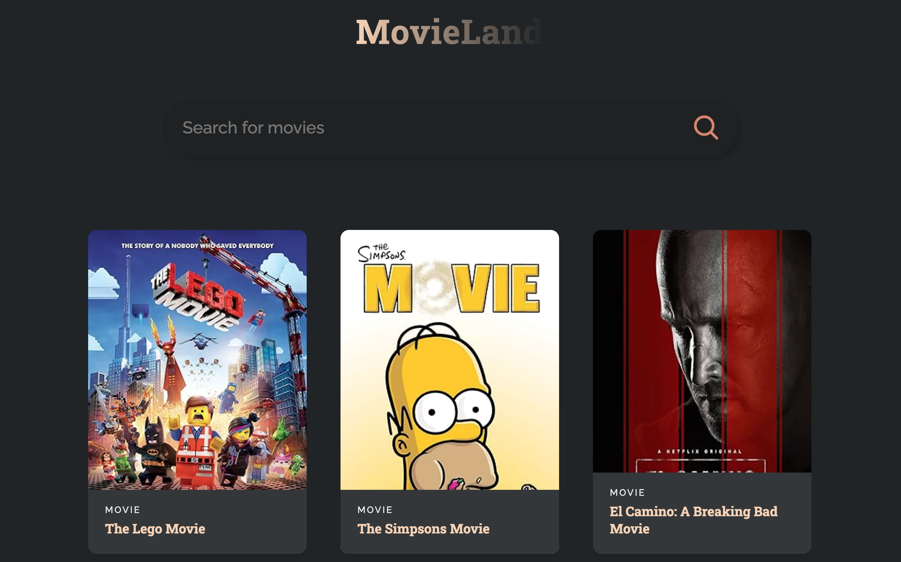

# Movie-App-Project
A movie app called "Movieland"!

### My first project with React.js.

This is a follow along project led by JavaScript Mastery's crash course on react.js. The aim of this assignment was to get my feet wet with create React app and API's. I learned the basics of React.js and how to integrate API's to my webpage. 

## Built With 

- HTML5
- CSS3
- React.js

## Prerequisites

You will need a web browser to view this project. No set up required. Works best on:

- Firefox
- Google Chrome
- Safari

## Live Demo

<https://raybgomez.github.io/Movie-App-Project/>

Deployed on [GitHub Pages](https://pages.github.com/) 

### Usage

Click on the above live demo link to view the page.
**Step 1** In the search bar, type in the keyword of the movie you're searching for.
**Step 2** Hit the enter key, and a list of movies will display with the keyword you have entered.
**Step 3** You can hover over the movie as if to select/click it. But movies are un-clickable.

## Acknowledgement

React JS Full Crash Course 2023 by [JavaScript Mastery](https://www.jsmastery.pro/) 

## Contributing

Contributions, issues, and feature requests are welcome!

## Show your support

Show your love by hitting the ⭐️ button, I'd really appreciate it.
